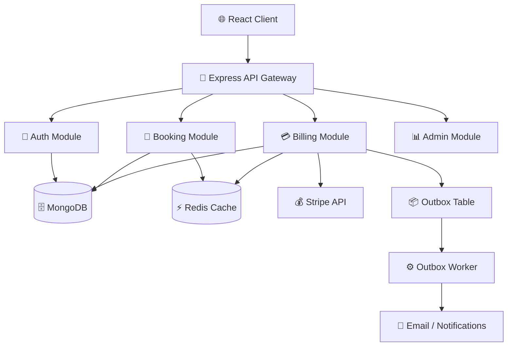
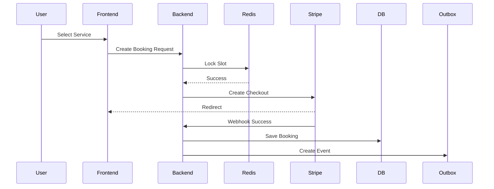
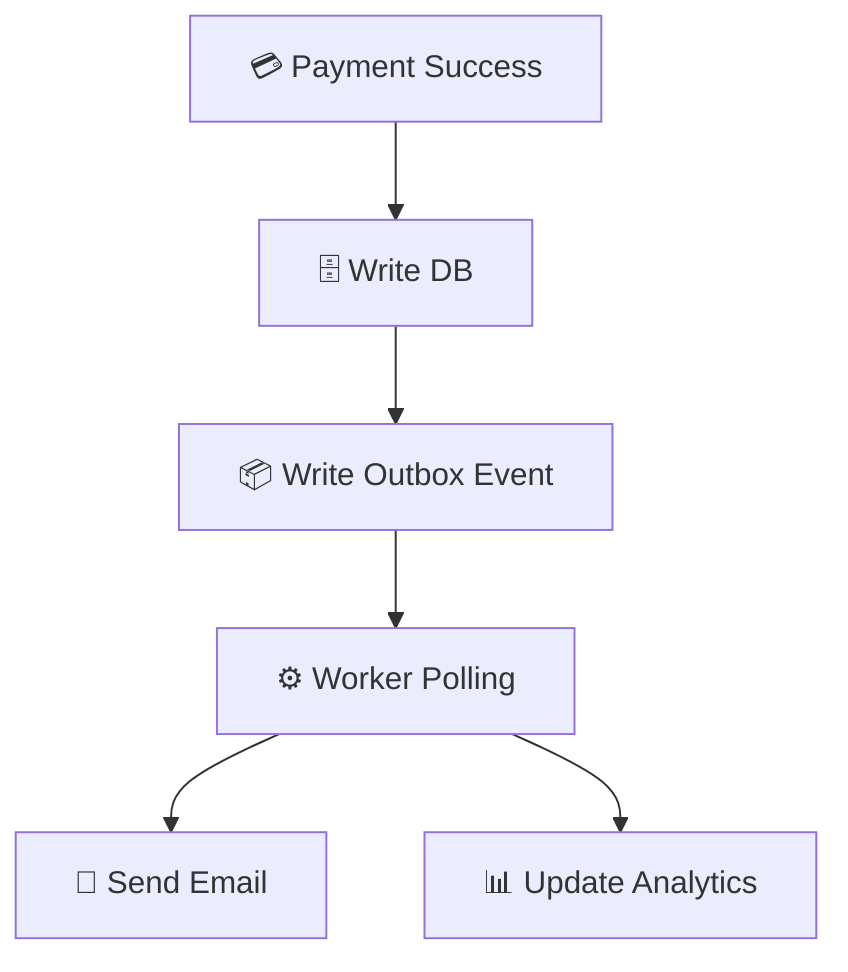

✨ GlowSuite
Overview

GlowSuite is a modular, production-grade salon booking platform built with a focus on clean architecture, real-time systems, and reliability patterns.

The system is organized around feature modules instead of a monolithic structure:

Auth handles authentication, authorization, and JWT issuance
Booking manages appointment lifecycle and slot availability
Billing handles Stripe payments, invoices, and payment state transitions
Admin provides dashboards, analytics, and booking management
Infrastructure modules handle Redis caching, WebSockets, and background workers

The platform simulates a real-world SaaS system, including:

Real-time booking with slot locking (Redis)
Stripe checkout + webhook confirmation
Outbox pattern for guaranteed reliability
Admin analytics dashboard
Event-driven architecture for scalability

Architecture

The runtime follows a clean, layered architecture:
frontend/
React (Vite) client

backend/
src/
modules/
auth/
booking/
billing/
admin/

    application/
      use-cases/

    domain/
      models/

    infrastructure/
      database/
      redis/
      websocket/
      queue/

    contracts/
      DTOs/

    workers/
      outboxWorker.js

    server.js

Layer Responsibilities
Domain → core business rules (Booking, Payment, User)
Application → use cases (CreateBooking, ProcessPayment)
Infrastructure → DB, Redis, Stripe, WebSockets
Contracts → API DTOs
Modules → feature isolation (Auth, Booking, Billing, Admin)

The API layer depends only on Application + Contracts, never directly on Domain.

## System Architecture Diagram



## Runtime Flow

The system processes requests through a reliable, event-driven flow:
Client sends request with JWT
API authenticates user and resolves role
Controller dispatches to application use-case
Business logic executes in domain layer
Data is persisted to MongoDB
Domain events are written to Outbox table
Worker processes events asynchronously
External systems (email, analytics) are triggered

## Booking Flow



## Key Features
🔴 Slot Locking (No Double Booking)
Uses Redis distributed locks
Prevents concurrent booking conflicts
Auto-expires after timeout

SETNX booking_lock:{slotId} userId EX 300

⚡ Real-Time Updates
WebSocket (Socket.IO)
Live slot availability updates
Instant UI refresh for all users

Payment System
Stripe Checkout integration
Webhook-based confirmation
Invoice + email flow

🧠 Outbox Pattern (Reliability)

Guarantees:

No lost payments
Retry failed operations
Decoupled system design



💀 Dead Letter Queue
Failed events stored separately
Supports retry and debugging

Modules

## Auth
User registration/login
JWT authentication
Role-based access control

## Booking
Create/update/cancel bookings
Slot availability logic
Redis lock integration

## Billing
Stripe checkout session
Webhook handling
Payment state tracking

## Admin
Dashboard analytics
Booking management
Status updates

## Tech Stack

### Frontend

- React + Vite
- Tailwind CSS
- Axios

### Backend

- Node.js + Express
- MongoDB (Mongoose)
- Redis

### DevOps

- Docker (planned)
- Kubernetes (EKS planned)
- CI/CD (GitHub Actions)

---

## CI/CD Pipeline

```yaml
name: CI/CD Pipeline

on:
  push:
    branches: [main]

jobs:
  build:
    runs-on: ubuntu-latest

    steps:
      - uses: actions/checkout@v3
      - run: npm install
      - run: npm test
      - run: npm run build
```

API Documentation (Swagger)

Swagger (OpenAPI) is included for API exploration.

Setup
npm install swagger-ui-express yamljs

import swaggerUi from "swagger-ui-express";
import YAML from "yamljs";

const swaggerDocument = YAML.load("./docs/swagger.yaml");

app.use("/api/docs", swaggerUi.serve, swaggerUi.setup(swaggerDocument));

Open in browser:

http://localhost:5000/api/docs

##Prerequisites
Node.js 18+
MongoDB (local or Atlas)
Redis

## Backend
cd backend
npm install
npm run dev

## Frontend
cd frontend
npm install
npm run dev

## Environment Variables

PORT=5000
MONGO_URI=your_mongodb_uri
JWT_SECRET=your_secret
STRIPE_SECRET_KEY=your_key
STRIPE_WEBHOOK_SECRET=your_webhook
REDIS_URL=redis://localhost:6379

Testing
Unit tests (Jest)
API tests (Supertest)
Booking flow validation
Stripe webhook tests

Deployment
Frontend → Vercel
Backend → Docker / AWS EC2 / EKS
Redis → AWS ElastiCache
MongoDB → Atlas

Documentation Map
README.md → system overview
docs/swagger.yaml → API documentation
src/modules/\* → feature modules
workers/ → background jobs
infrastructure/ → external systems

GlowSuite demonstrates:

Clean Architecture (modular design)
Real-time system design
Distributed locking (Redis)
Payment reliability patterns
Event-driven architecture
Production-ready backend thinking
